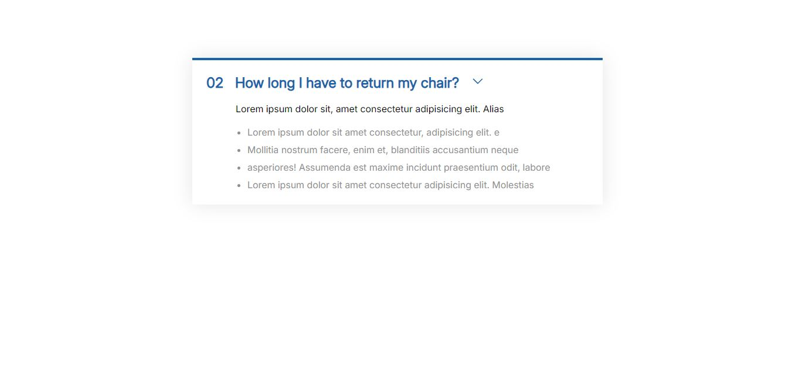
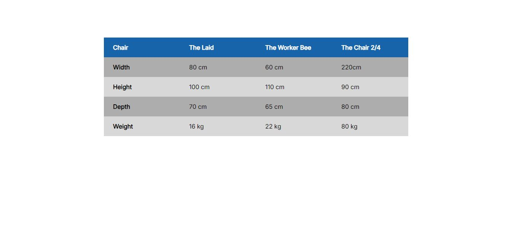

📚 Credits
This repository was created based on the studies from the "HTML & CSS Course – Build Responsive Real-World Websites" by Jonas Schmedtmann.

# Component Applications

Este repositório contém implementações de componentes reutilizáveis desenvolvidos com HTML e CSS. Cada componente está armazenado em uma pasta separada com seu respectivo arquivo de estilo e uma imagem de demonstração.

This repository contains implementations of reusable components developed with HTML and CSS. Each component is stored in a separate folder with its respective stylesheet and a demonstration image.

## Components / Componentes

### Carousel  
  
🔗 [Ver código HTML](component-applications/carousel/carousel.html)

### Accordion  
  
🔗 [Ver código HTML](component-applications/accordion/index.html)

### Table  
  
🔗 [Ver código HTML](component-applications/table/table.html) 

### Pagination  
  
🔗 [Ver código HTML](component-applications/pagination/pagination.html) 

## Usage / Uso

Para visualizar cada componente, basta abrir o arquivo `index.html` correspondente no navegador.

To view each component, simply open the corresponding `index.html` file in the browser.

## Technologies Used / Tecnologias Utilizadas
- HTML
- CSS

## License / Licença  
Este projeto está sob a Licença MIT. Veja o arquivo LICENSE para mais detalhes.  

This project is licensed under the MIT License. See the LICENSE file for more details.
